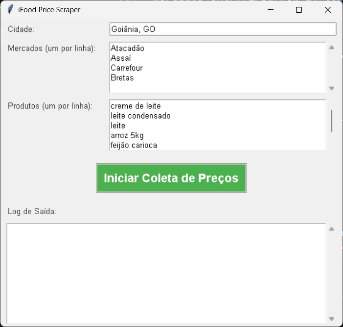

# iFood Price Scraper GUI

[](https://www.python.org/)
[](https://www.selenium.dev/)
[](https://developers.google.com/sheets/api)



**Captura de preços de supermercados no iFood com interface gráfica simples e eficiente.**

## Descrição do Projeto

Este projeto é um script Python que utiliza Selenium para automatizar a coleta de preços de produtos de supermercados no iFood. Ele oferece uma interface gráfica de usuário (GUI) construída com Tkinter, permitindo que você defina facilmente os mercados e produtos desejados para a coleta. Os dados coletados podem ser salvos em uma planilha do Google Sheets e também em um arquivo Excel local para backup.

**Funcionalidades Principais:**

*   **Interface Gráfica Intuitiva:** Facilita a configuração da coleta de preços através de campos de entrada para cidade, mercados e produtos.
*   **Coleta Automatizada de Preços:** Utiliza Selenium para navegar no iFood e extrair os preços dos produtos especificados nos mercados selecionados.
*   **Suporte a Múltiplos Mercados:** Permite definir uma lista de mercados para realizar a busca de preços simultaneamente.
*   **Lista Personalizável de Produtos:** Você pode inserir uma lista de produtos desejados, um por linha, para serem pesquisados em cada mercado.
*   **Salvar em Google Sheets:** Integração com a API do Google Sheets para salvar os dados coletados diretamente em uma planilha online para fácil acesso e compartilhamento.
*   **Backup Local em Excel:** Salva automaticamente uma cópia dos dados em um arquivo Excel (`precos_ifood_backup.xlsx`) para segurança e uso offline.
*   **Modo Headless:** Opera em modo headless (segundo plano) após o login inicial e configuração do endereço, tornando a execução mais rápida e discreta.
*   **Otimizado para Velocidade:** Configurado para coletar os dados de forma eficiente, minimizando tempos de espera sem comprometer a estabilidade.
*   **Log de Saída na GUI:** Exibe um log detalhado do processo de coleta na interface gráfica, permitindo acompanhar o progresso e identificar possíveis erros.

## Começando

Siga estas instruções para configurar e executar o iFood Price Scraper GUI no seu sistema.

### Pré-requisitos

Antes de começar, você precisará ter instalado:

*   **Python 3.7 ou superior:**  Você pode baixar o Python em [python.org](https://www.python.org/).
*   **Bibliotecas Python:** As seguintes bibliotecas Python são necessárias e podem ser instaladas usando `pip`:
    ```bash
    pip install pandas selenium gspread oauth2client webdriver-manager tkinter ttkthemes
    ```
*   **Google Chrome Navegador:** O script utiliza o Google Chrome para navegar no iFood. Certifique-se de tê-lo instalado.
*   **ChromeDriver:** O ChromeDriver é necessário para o Selenium controlar o Chrome. O `webdriver-manager` deve instalar automaticamente o ChromeDriver compatível, mas em caso de problemas, você pode precisar baixá-lo manualmente em [chromedriver.chromium.org](https://chromedriver.chromium.org/downloads) e adicionar o caminho ao PATH do seu sistema.

### Instalação

1.  **Clone o repositório:**
    ```bash
    git clone [URL do seu repositório no GitHub]
    cd [nome-do-repositório]
    ```
2.  **Instale as dependências Python:** (Caso ainda não tenha feito)
    ```bash
    pip install -r requirements.txt
    ```
    *Nota:* Crie um arquivo `requirements.txt` na raiz do seu projeto com as seguintes linhas para facilitar a instalação das dependências:
    ```
    pandas
    selenium
    gspread
    oauth2client
    webdriver-manager
    ttkthemes
    ```

### Configuração

1.  **Credenciais da API Google Sheets:**
    *   Para salvar os dados no Google Sheets, você precisará configurar as credenciais da API do Google Sheets. Siga [este guia](https://console.cloud.google.com/apis/credentials) para criar um projeto no Google Cloud Console, habilitar a API Google Sheets e gerar um arquivo de credenciais JSON (`credentials.json`).
    *   Coloque o arquivo `credentials.json` na mesma pasta do script `scraper_gui.py`.
2.  **Arquivo `cookies.pkl`:**
    *   Na primeira execução, o script irá criar um arquivo `cookies.pkl` na mesma pasta. Este arquivo armazena os cookies de login do iFood para sessões futuras.
3.  **Configuração na GUI:**
    *   Ao executar o script `scraper_gui.py`, você poderá configurar os seguintes campos na interface gráfica:
        *   **Cidade:** Insira a cidade para a busca de mercados (ex: "São Paulo, SP").
        *   **Mercados:** Insira os nomes dos mercados que deseja buscar, um por linha (ex: "Atacadão", "Assaí", "Carrefour").
        *   **Produtos:** Insira os nomes dos produtos que deseja pesquisar, um por linha (ex: "creme de leite", "leite condensado", "arroz 5kg").

### Executando o Scraper

1.  **Execute o script:**
    ```bash
    python scraper_gui.py
    ```
2.  **Interface Gráfica:** A interface gráfica do iFood Price Scraper GUI será aberta.
3.  **Login no iFood (se necessário):**
    *   Se for a primeira vez ou se os cookies expiraram, o script abrirá uma janela do navegador Chrome visível.
    *   **Faça login manualmente** na sua conta do iFood nesta janela do navegador. O script aguardará até que você esteja logado (por até 60 segundos).
    *   Após o login bem-sucedido, o script salvará os cookies para sessões futuras.
4.  **Definir Endereço (se necessário):**
    *   Se o endereço não estiver definido ou se for a primeira execução, o script tentará usar sua localização atual ou pedirá para você definir um endereço na interface do navegador.
5.  **Iniciar a Coleta:**
    *   Preencha os campos de "Cidade", "Mercados" e "Produtos" na interface gráfica.
    *   Clique no botão **"Iniciar Coleta de Preços"**.
6.  **Acompanhar o Log:** O log de saída mostrará o progresso da coleta de preços.
7.  **Resultados:**
    *   Os dados coletados serão salvos em uma planilha do Google Sheets (se configurado corretamente) e em um arquivo Excel (`precos_ifood_backup.xlsx`) na mesma pasta do script.
    *   Uma mensagem de conclusão será exibida na interface gráfica.

## Usando a Interface Gráfica

A interface gráfica é simples e direta:

*   **Campo "Cidade":** Insira a cidade onde você deseja buscar os preços dos mercados.
*   **Área de texto "Mercados (um por linha)":** Insira a lista de mercados que você deseja pesquisar. Cada mercado deve estar em uma linha separada.
*   **Área de texto "Produtos (um por linha)":** Insira a lista de produtos que você deseja pesquisar os preços. Cada produto deve estar em uma linha separada.
*   **Botão "Iniciar Coleta de Preços":** Clique neste botão para iniciar o processo de scraping.
*   **Área de texto "Log de Saída":** Esta área exibe o log do processo de scraping em tempo real, mostrando o progresso e quaisquer mensagens de erro ou informações relevantes.

## Configuração do Google Sheets

Para salvar os dados no Google Sheets, você precisa:

1.  **Criar um Projeto no Google Cloud Console:** Acesse [console.cloud.google.com](https://console.cloud.google.com/) e crie um novo projeto ou selecione um projeto existente.
2.  **Habilitar a API Google Sheets:** No seu projeto, vá para "APIs e Serviços" -> "Biblioteca" e procure por "Google Sheets API". Habilite a API.
3.  **Criar Credenciais:** Vá para "APIs e Serviços" -> "Credenciais" -> "Criar credenciais" -> "Conta de serviço".
    *   Dê um nome à conta de serviço (ex: "ifood-scraper").
    *   Conceda à conta de serviço o papel de "Editor" (ou um papel com permissões de escrita no Sheets API).
    *   Clique em "Criar" e depois em "Concluído".
4.  **Gerar Chave JSON:** Clique no nome da conta de serviço que você criou. Vá para a aba "Chaves" -> "Adicionar chave" -> "Criar nova chave". Escolha o tipo "JSON" e clique em "Criar".
5.  **Salvar `credentials.json`:** O arquivo `credentials.json` será baixado. Mova este arquivo para a mesma pasta do seu script `scraper_gui.py`.
6.  **Criar Planilha no Google Sheets:** Crie uma nova planilha no Google Sheets e copie o **ID da planilha** da URL (é uma longa sequência de caracteres entre `/d/` e `/edit`).
7.  **Atualizar o Código (opcional, ID da Planilha):** No script `scraper_gui.py`, localize a linha:
    ```python
    spreadsheet_id = '1oGjtfzZ7rhF4qWzEQ-wMPO042AhHo_jACv2L040uXAQ' # <---- Cole SEU ID AQUI
    ```
    Substitua `'1oGjtfzZ7rhF4qWzEQ-wMPO042AhHo_jACv2L040uXAQ'` pelo ID da planilha que você criou.  Se você não fizer isso, os dados serão salvos na planilha padrão de exemplo.

**Importante:** Certifique-se de que a conta de serviço (o email dentro do seu `credentials.json`) tenha permissão de edição na planilha do Google Sheets que você deseja usar. Você pode compartilhar a planilha com o email da conta de serviço como "Editor".

## Disclaimer

Este script foi desenvolvido para fins educacionais e de uso pessoal. A coleta de dados de websites (web scraping) deve ser feita de forma ética e responsável, respeitando os termos de serviço e a política de privacidade do iFood. O uso indevido deste script pode violar os termos de serviço do iFood e resultar em consequências legais.

**Use este script por sua conta e risco.** O autor não se responsabiliza por qualquer uso indevido ou danos resultantes da utilização deste projeto.

**Contribuições:**

Sinta-se à vontade para contribuir com este projeto! Abra issues para relatar bugs ou sugerir melhorias, e envie pull requests com suas contribuições.

**Autor:**

Pedro Aquino Barros
